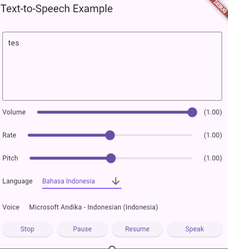

# Text To Speech

Nama : Fajar Shodiq
Nim : 22108015
UTS : Pemrograman Perangkat Bergerak

Plugin Flutter menyediakan Layanan TTS (Text-To-Speech). Plugin ini bertujuan untuk menawarkan sebagian besar fitur API TTS dari iOS, Android, web, dan macOS.



## Features

1. Kolom Input
2. Text to Speech Generate
3. Mengatur Volume, Rate, Pitch
4. Button Stop, Pause, Resume dan Speak

## Getting Started

Untuk menggunakan plugin ini, tambahkan `text_to_speech` sebagai dependensi dalam file pubspec.yaml Anda:

```yaml
dependencies:
  text_to_speech: ^0.2.3
```

### Android

- Minimum SDK version: `21`
- Applications targeting SDK 30 (Android 11) need to declare `TextToSpeech.Engine.INTENT_ACTION_TTS_SERVICE` in the `queries` elements of Android Manifest (See [Android documentation](https://developer.android.com/reference/android/speech/tts/TextToSpeech)).

```
<queries>
  <intent>
      <action android:name="android.intent.action.TTS_SERVICE" />
  </intent>
 </queries>
```

### iOS & macOS

- iOS minimum version: `7.0`
- macOs minimum version `10.14`

(See [Apple documentation](https://developer.apple.com/documentation/avfaudio/avspeechsynthesizer)).

## Features

|   Feature    |      Android       |        iOS         |        Web         |       macOS        |
| :----------: | :----------------: | :----------------: | :----------------: | :----------------: |
|    speak     | :white_check_mark: | :white_check_mark: | :white_check_mark: | :white_check_mark: |
|     stop     | :white_check_mark: | :white_check_mark: | :white_check_mark: | :white_check_mark: |
|    pause     |         -          | :white_check_mark: | :white_check_mark: | :white_check_mark: |
|    resume    |         -          | :white_check_mark: | :white_check_mark: | :white_check_mark: |
|  set volume  | :white_check_mark: | :white_check_mark: | :white_check_mark: | :white_check_mark: |
|   set rate   | :white_check_mark: | :white_check_mark: | :white_check_mark: | :white_check_mark: |
|  set pitch   | :white_check_mark: | :white_check_mark: | :white_check_mark: | :white_check_mark: |
| set language | :white_check_mark: | :white_check_mark: | :white_check_mark: | :white_check_mark: |
| get language | :white_check_mark: | :white_check_mark: | :white_check_mark: | :white_check_mark: |
|  get voice   | :white_check_mark: | :white_check_mark: | :white_check_mark: | :white_check_mark: |

## Usages

Untuk memulai, impor dependensi dalam kode Anda:

```
import 'package:text_to_speech/text_to_speech.dart';
```

Kemudian, buat instance kelas TextToSpeech:

```
TextToSpeech tts = TextToSpeech();
```

**Speak**

```
String text = "Hello, Bujang!";
tts.speak(text);
```

```
List<String> voices = await tts.getVoices();

String language = 'en-US';
List<String> voices = await tts.getVoiceByLang(language);
```

## Native API Reference

- Android TTS API: https://developer.android.com/reference/android/speech/tts/TextToSpeech
- iOS/macOS AVSpeechSynthesizer API: https://developer.apple.com/documentation/avfaudio/avspeechsynthesizer
- Web Speech API: https://dvcs.w3.org/hg/speech-api/raw-file/tip/speechapi.html#tts-section

```
$ cd example
```

Run Android / iOS

```
$ flutter run -d <device_name>
```

Run Web

```
$ flutter run -d chrome
```

Run macOS

```
$ flutter run -d macOS
```
